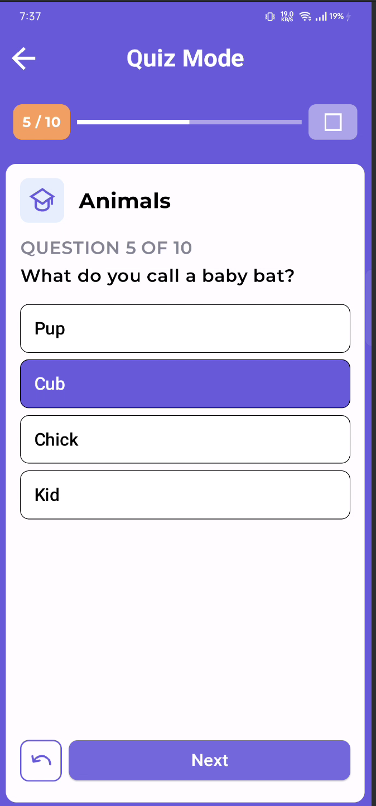
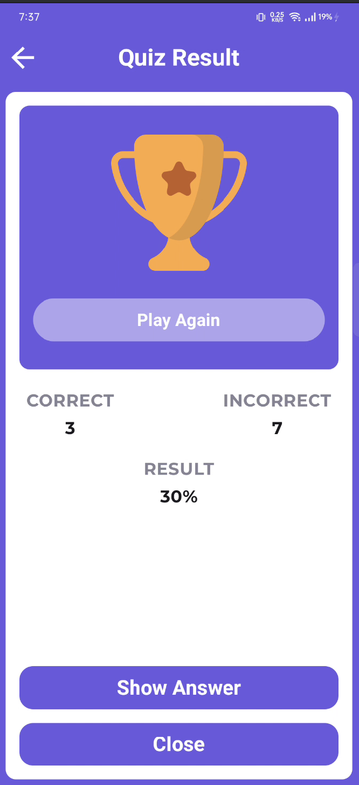
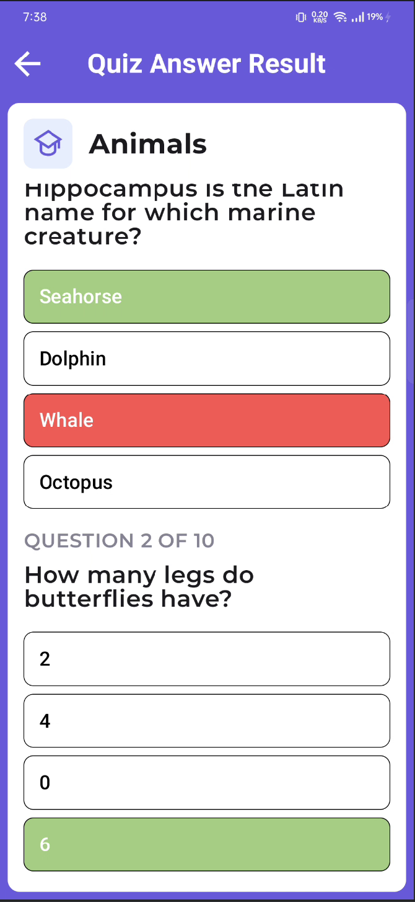
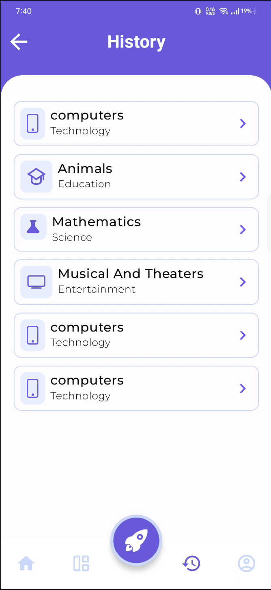

# yet another quiz game

A fun and educational quiz app where users can answer questions, see correct answers, and track their progress. 
Ideal for your nerdy brain.

## Tech Stack

This project was built using the following technologies and tools:

- **Kotlin**: Used as the primary programming language for Android development.
- **Jetpack Compose**: For building modern, responsive, and declarative UI components.
- **Room Database**: For local data storage and management of quiz history and user progress.
- **Retrofit**: For making API calls to fetch quiz questions.
- **Koin**: Dependency injection framework used for efficient dependency management.
- **Coroutines**: For asynchronous programming, allowing for smooth data retrieval and processing.
- **Material Design 3**: Ensures a modern and user-friendly interface.

---

## Screens

| Home Screen                      | Category Screen                       | Category Screen                       |
|----------------------------------|---------------------------------------|---------------------------------------|
|  |  |  |

| Quiz Start Screen                      | Quiz Settings Screen                    | Quiz Mode Screen                      |
|----------------------------------------|-----------------------------------------|---------------------------------------|
|  |  |  |

| Quiz Result Screen                      | Quiz Answer Screen                      | Quiz History Screen                 |
|-----------------------------------------|-----------------------------------------|-------------------------------------|
|  |  |  |

## Disclaimer
All credits go to the original creator: [MuhammadRadifa/QuizKit](https://github.com/MuhammadRadifa/QuizKit).